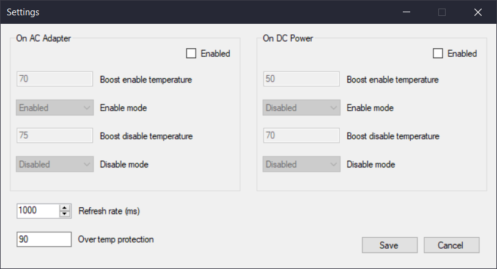

# g14boost
Toggle boost based on temperature

Download the [latest release](https://github.com/furui/g14boost/releases).

With this utility you can set thresholds for turning on and off boost. This means you can effectively leave boost on and give compilers, photo editing programs, video editing programs, web browsers, etc. the boost that makes them snappier. But at the same time, you can keep the CPU from boosting into the danger zone in long running, high CPU scenarios such as running games.

This utility was designed with the ASUS Zephyrus G14 in mind, but may work on other machines such as the [ASUS TUF Gaming A15](https://amzn.to/31MnPCC) or [Razer Blade 15](https://amzn.to/3lAB5lL)**.

Caveats:

* No warranty provided of any sort nor is any guarantee offered that the application will work. It may break your computer! You have been warned.
* This program will definitely mess with your registry settings and system settings. Antivirus and security software may complain and light up like Christmas lights while the software is active!
* No out-of-the-box way to start it with Windows boot-up but you can probably add it via Task Scheduler.
* Application polls CPU temperature and settings, and it may cause you to get worse battery life if you are striving to save those millivolts.

In the future:

* Profiles
* Automatically selected profiles based on running process
* Automatically selected profiles if applications are running full screen
* Start on Windows bootup option
* Installer of some sort

** Affiliate links to pay for my lunch! Or you can buy me a [Ko-Fi](https://ko-fi.com/furui) to support my work!